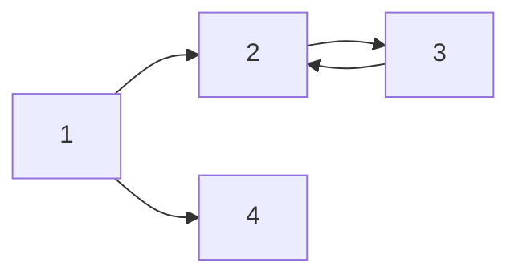

# Markdown

### 배경 
:John Gruber, Aaron Swartz에 의해 개발된 Plain-text 포맷을 기본으로한 경량형 마크업 언어임.

### 특징 
- .md 확장자파일로 텍스트 에디터에서도 키보드 하나로 쉽게 포맷하면서 빠르게 문서를 작성할 수 있음. 
- 특히 깃허브에서 Readme.md로 주로 쓰여서 대부분의 문서를 markdown으로 주로 쓰게 된다! 
- PR(Pull Request)하는 경우에도 많이 쓰임
- 많은 디지털 문서를 작성할 떄도 키보드로 작성할 수 있게 도와줌! 
- 개발자인 우리들도 일반적인 블로그를 활용하기 보다는 마크다운 언어로 자체적인 블로그 글을 작성하는 것이 보다 수월할 것으로 판단됨.
- VS Code에서는 Markdown Preview를 써보는 것을 강력 추천한다! 

## 문법

### Heading
: 총 6가지의 형태로 제공되며 # 1개에서부터 5개까지, 없는 형태까지로 구성된다. 
-> Heading 1의 경우는 라인이 형성되는데
언더스코어(_)를 세번 누르게 되면 라인이 형성된다! 

### Text
- bold : ** ** ex)**내용**
- italic : * * ex) *italic*
- strikethrough : ~~ ~~ : ex)~~strike~~  

- Quote : > 
> quote

- Bullte List : * or - or 1.

- Link : Click [here](http://startupdevelopers.tistory.com)


- Table
: |와 -, :(정렬용)만 쓰면 된다 
| | |
|-- |-- |

|Header|Description|
|:--:|--:|
|Cell1|Cell2 |

- Code : `` or `````` and language

To print message in the console, user `console.log('your message)` and ..

백태그 뒤에 언어 붙이면 언어형으로 바꿀수가 있다! 

- Check box - [ ], [x]
- [x] d
- [ ] d
```java
console.log('your message)
```

[추가 참고 사이트 : Github Flavored Markdown](https://github.github.com/gfm/)

사진도 추가하면서 url 추가하게 할 수도 있다. (이때 html img 태그 활용해서 
img src="" width="400" 이렇게 할수도 있다.)

정리하면 
'#'를 활용한 Heading, '[]''()'기반의 이미지나 url 넣기 등이 될 거 같으며, 스타일로 *를 활용한 bold, italic체, >를 활용한 quote라고 정리할 수 있을 거 같다!

[출처 : 드림코딩 엘리](https://youtu.be/kMEb_BzyUqk)

----
# 활용 예시

# H1 태그( 제목)
## 지현 
### 지현
#### 지현
##### 지현 (일반 크기와 같음)

_italic_

**bold**

**_italic+bold_**
~~hello~~

>안녕하세요 이건 Quote 입니다. ~

---

- list 1
- list 2
- list 3
    - A
    - B

1. List 1
2. List 2
3. List 3
    1. A
    2. B


| Title | Description | 비고|
| -|-|-|
|안녕|1|2|
|할로|3|4|

---


[지현님의 블로그](blog.naver.com/j4849)


---


`simple code`

``` python
#include <studio.h>
int mains(){
    printf("hello world");
    return 0;
}
```

----

$a^2 + b^2 = c^2$

---

