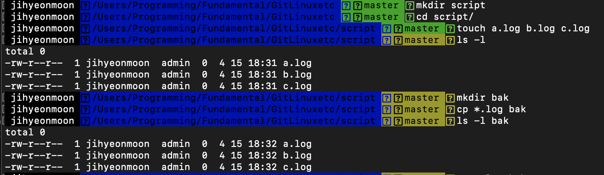
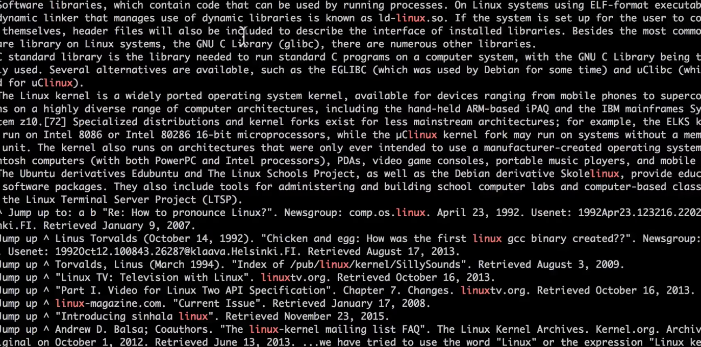

# shell script


## Shell Script 명령어 정리


### 기본 명령어

|명령어	|설명|
|:--:|:--:|
|pwd|	현재 경로 출력|
|ls	|현재 디렉토리에서의 파일 리스트 출력|
|ls -l|	접근권한, 생성시간을 포함한 파일 상세 리스트 출력|
|mkdir [directory name]|	새로운 디렉토리 생성|
|cd cd ./ cd ../ cd [path]|	home 디렉토리로 이동 현재 디렉토리로 이동 바로 이전 디렉토리로 이동 설정한 경로 디렉토리로 이동|
|cat test.txt|	test.txt의 내용 출력|
|history [n]|	지금까지 입력한 명령어 목록 출력 숫자를 정해 최근 n개의 명령어만 출력하게 할 수도 있다.|
|cp filename1 directory	|파일 복사|
|mv	|파일 이동|
|rm	|파일 삭제 디렉토리 삭제 시, -r 옵션 부여|
|find [directory name] -name "file.txt"	|디렉토리를 설정하지 않으면 현재 디렉토리에서 모든 하위 폴더의 이름을 찾아 출력|
|touch foo.txt|	0바이트 파일 생성|

## 자주 쓰일 수 있는 것
1. grep
 : 기본 출력이나 파일에서 지정한 패턴과 일치하는 라인을 탐색하는 명령어, 패턴은 정규표현식을 사용.
ex) grep [Options] PATTERN [FILE...]
 
2. watch 
: 지정한 명령어를 일정 주기로 반복하여 실행하는 명령어. 주로 프로세스를 모니터링 할 때 사용됨.

ex) watch [Options..]명려어

3. wc
: 파일의 라인, 단어, Byte의 수를 출력하는 명령어
 
ex) wc [OPTIONS..][FILE]

4. head
: 파일의 처음 라인에서 밑으로 10개의 라인을 출력. 주로 데이터 파일을 확인할 떄 사용 

ex) head [OPTIONS...][FILES...]

5. tail
: 파일의 마지막 라인에서 위로 10개의 라인을 출력. 주로 로그를 모니터링할 때 사용.

ex) tail [OPTIONS...][FILES...]




- mkdir : 디렉토리를 만든다.
- cd : 디렉토리로 이동한다.
- touch : 빈 파일을 만든다.
- ls -l : 하위 항목들을 보여준다.
- cp : 복사를 진행한다.
    - cp *.log bak : log 파일을 복사하여 bak 폴더에 붙여넣는다.

- nano backup : backup이란 파일을 만든다.
```linux
#!/bin/bash

if [ -d bak ]; then
        mkdir bak
fi
cp *.log bak
```
- 위 코드는 bak 없으면 만들고, 로그 파일을 복사하라는 명령어이다.
-**제일 중요한거! chmod +x backup**하게 되면 permision을 추가할 수 있다!! 


### 출처 사이트
[생활코딩](https://youtu.be/cXnVygkAg4I)

## Sudo

- sudo(super user do) : 다중 사용자 시스템으로 운영되다 보니, 사용자간의 권한을 구분하게 되엇다.(permission)
- super user, root user 등이 등장하게 되었다! 

- 예를 들어 apt-get install git을 하게 되면 `Permission denied`가 나왔지만, sudo를 추가하면 설치가 가능해진다!

### 출처 사이트
[생활코딩](https://youtu.be/X7kAUlbZV4Q)

## Why using CLI? GUI vs CLI
- GUI는 메모리를 많이 잡아먹지만(사용성을 높이기 위해서), 그러나 서버와 같은 전문적인 부분은 Graphical하지 않도록 CLI방식으로 운영하게 된다.

- GUI가 오히려 생각보다 많은 노동이 요구되기도 한다. (될때까지 기다려야하는 문제점이 있다.)

## Why using CLI? - Sequence execution (semicolon)
- shell 창에서 두개 이상 명령어 입력하길 원한다면 ;를 입력하면 계속 가능해진다! 

## Why using CLI? pipeline
- cat을 치면, 우리가 저장한 파일을 들어가서 볼 수 있게 한다! 

- grep linux linux.txt하면 우리가 원하는 검색어를 노출시킬 수 있다. 


- | : pippeline 예를 들어 ls --help를 할때 `ls --sort | grep sort`을 하게 되면 우리가 원하는 두기능을 한번에 볼수가 있게 된다! `ls --sort | grep sort | grep file`하게 되면 모두 만족하는 것을 보여주게 된다.

[출처 사이트](https://youtu.be/nCi2QYbNow4)

### 출처 사이트

### 출처 사이트