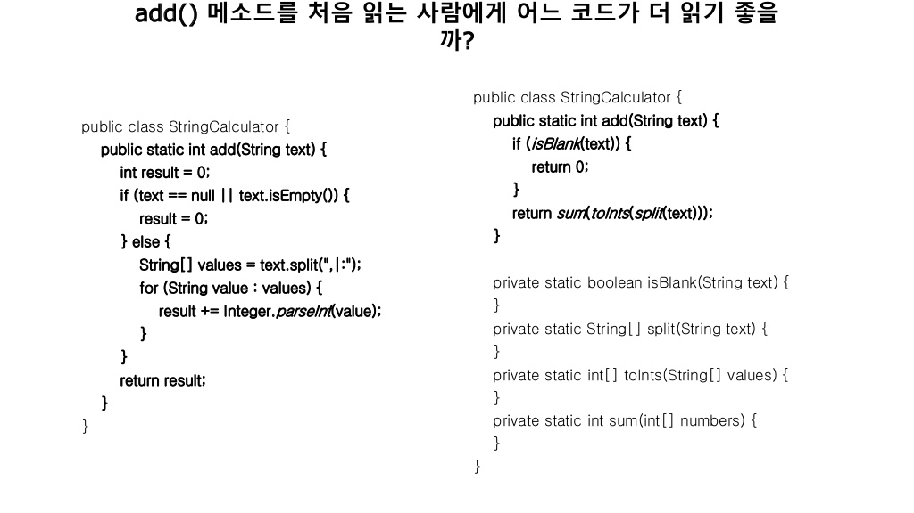

# 자바지기 TDD 영상 및 자료

[우아한테크세미나\_TDD 리팩토링](https://www.youtube.com/watch?v=bIeqAlmNRrA)
<br>

[2018 의식적인 연습으로 TDD 리팩토링 연습하기](https://www.youtube.com/watch?v=cVxqrGHxutU)
<br>

[Slide자료](https://www.slideshare.net/OKJSP/okkycon-tdd)

## 의식적인 연습의 7가지 원칙

- 첫째, 효과적인 훈련 기법이 수립되어 있는 기술 연마
- 둘째, 개인의 컴포트 존을 벗어난 지점에서 진행, 자신의 현재 능력을 살짝 넘어가는 작업을 지속적으로 시도
- 셋째, 명확하고 구체적인 목표를 가지고 진행
- 넷째, 신중하고 계획적이다. 즉, 개인이 온전히 집중하고 '의식적'으로 행동할 것을 요구
- 다섯째, 피드백과 피드백에 따른 행동 변경을 수반
- 여섯째, 효과적인 심적 표상을 만들어내는 한편으로 심적 표상에 의존
- 일곱째, 기존에 습득한 기술의 특정 부분을 집중적으로 개선함으로 써 발전시키고, 수정하는 과정을 수반

## 1단계 - 단위 테스트 연습

1. 내가 사용하는 API 사용법을 익히기 위한 학습 테스트에서 시작

- 자바 String 클래스의 다양한 메소드(함수) 사용법
- 자바 ArrayList에 데이터를 추가, 수정, 삭제하는 방법

2. 구현하는 메소드(함수) 중 Input과 Output이 명확한 클래스 메소드(보통 Util 성격의 메소 드) 에 대한 단위 테스트 연습

3. 알고리즘 구현에 대한 검증을 단위 테스트로 한다. 알고리즘은 Input, Output이 명확하기 때문에 연습하기 좋다.

## 2단계 - TDD 연습

- 지켜야 할 원칙

1. 회사 프로젝트에 연습하지 말고 장난감 프로젝트를 활용해 연습하자.
2. 웹, 모바일 UI나 DB에 의존관계를 가지지 않는 요구사항으로 연습한다.

- 문자열 덧셈 계산기 요구사항

1. 쉼표(,) 또는 콜론(:)을 구분자로 가지는 문자열을 전달하는 경우 구분자를 기준으로 분리한 각 숫자의 합을 반환

| 입력(input)  | 출력(output) |
| :----------: | :----------: |
| null 또는 “” |      0       |
|     "1"      |      1       |
|    "1,2"     |      3       |
|   "1,2:3"    |      6       |

- 어려운 문제를 해결하는 것이 목적이 아니라 TDD 연습이 목적 난이도가 낮거나 자신에게 익숙한 문제로 시작하는 것을 추천

## 3단계 - 리팩토링 연습

테스트 코드는 변경하지 말고 테스트 대상 코드(프로덕션 코드)를 개선하는 연습을 한다.

막상 리팩토링을 하라고 하면, 어떻게 시작해야할지 모르는 막막함과 멘붕이 온다.

앞서 말한 **의식적인 연습 7가지 원칙**을 다시 기억하자.

- 셋째, 명확하고 구체적인 목표를 가지고 진행
- 다섯째, 피드백과 피드백에 따른 행동 변경을 수반
  즉, 정성적인 기준보다는 정량적이고 측정 가능한 방법으로 연습해야 한다.

### 리팩토링 Point - 1. 메소드 분리

1. 한 메서드에 오직 한 단계의 들여쓰기(indent)만 한다.
   들여쓰기가 2인 곳을 찾아 메소드를 분리한다.

2. else 예약어를 쓰지 않는다.

→ 코드가 간결해지고, 가독성이 좋아진다.

if문에서 바로 return문을 쓰면, 더이상 아래 코드를 보지 않아도 되기 때문에 간결하고 명확하다.

기존 코드는 result 값을 가지고 아래로 내려가면서 return 문이 나올 때까지 코드를 읽어야하는 상황이다.

3. 메소드가 한 가지 일만 하도록 구현하기

```java
public static int sum(String[] values) {
  int result = 0;
  for (String value : values) {
    result += Integer.parseInt(value);
  }
  return result;
}
```

→ 현재 sum() 메소드는 두가지 일을 하고 있다. (1) 문자열 → 숫자로 변환, (2) 합을 계산

```java
public static int[] toInts(String[] values) {
  int[] numbers = new int[values.length];
  for (int i = 0; i < values.length; i++) {
    numbers[i] = Integer.parseInt(values[i]);
  }
  return numbers;
}

public static int sum(int[] numbers) {
  int result = 0;
  for (int number : numbers) {
    result += number;
  }
  return result;
}
```

**4. 로컬 변수가 정말 필요한가? - 메소드를 쪼개다 보면 들 수 있는 의심**

```java
String[] values = text.split(",|:");
int[] numbers = toInts(values);
return sum(numbers);
```

→ 현재 main() 메소드에서 values, numbers라는 로컬 변수를 굳이 써야하는지 의심이 든다.

로컬 변수를 다른 곳에서 사용할 일이 없다면 굳이 만들어서 쓸 필요 없이 **바로 계산된 값을 넘겨주면 된다.**

```java
return sum(toInts(text.split(",|:")));
```

5. compose method 패턴 적용

패턴 적용 메소드(함수)의 의도가 잘 드러나도록 동등한 수준의 작업을 하는 여러 단계로 나눈다.

아래 return문은 메소드를 뽑은 추상화 단계 1이 되는 것이고, if문은 추상화 단계가 0이므로 이를 1단계로 수정해주자

```java
class StringCalculator {
  public static int splitAndSum(String text) {
    if (text == null || text.isEmpty()) { //추상화 단계 0
      return 0;
    }
    return sum(toInts(text.split(",|:"))); //추상화 단계 1
  }
```

→ **if 조건문을 isBlank() 메소드로 분리하여 추상화 1단계로 만들어 주었다.**

```java
public static int splitAndSum(String text) {
  if (isBlank(text)) {
    return 0;
  }
  return sum(toInts(text.split(",|:")));
}

public static boolean isBlank(String text) {
  return text == null || text.isEmpty();
}
```

지금은 연습용 toy 프로젝트 이기때문에 극단적으로 만들어야 insight(통찰력)이 생긴다. 과하게 해야 느껴지는 것이 있지 그냥 하던대로 하면 잘 느끼지 못한다.

6. add() 메소드를 처음 읽는 사람에게 어느 코드가 더 읽기 좋을 까?

리팩토링한 우측 코드가 읽기가 좋다. 한번에 전체적인 메소드의 로직이 보인다.

좀 더 구체적인 split 하는 부분이 궁금하면 그 때, split() 메소드를 들어가서 로직을 확인하면 된다.

즉, 한번에 모든 코드를 들어내서 이 메소드가 무슨 일을 하는지를 파악하려면 전체를 다 봐야되는 것 보다는 **추상화 레벨을 한단계 더 줘서 메소드를 분리한 다음에 전체적인 흐름 로직이 보이도록 만들고, 그다음에 궁금하면 한단계 더 들어가서 확인하라는 것이다.**



7. 한 번에 모든 원칙을 지키면서 리팩토링하려고 연습하지 마라. 한 번에 한 가지 명확하고 구체적인 목표를 가지고 연습하라.

한 번에 1~5번 원칙을 지키려고 하지말고, 한 번에 한 단계의 원칙만 지켜가며서 연습해라

(\* 그리고 토이 프로젝트로 연습해야지 일정에 압박이 있는 상태의 프로젝트에서는 창의력인 생각이 잘 안떨어지기 때문에 코드가 잘 안나온다.)

8. 연습은 극단적인 방법으로 연습하는 것도 좋다.

예를 들어 한 메소드의 라인 수 제한을 15라인 -> 10라인으로 줄여가면 서 연습하는 것도 좋은 방법이다.

이렇게 줄여가다 보면 분명히, 뭔가 설계를 완전히 뒤집지 않으면 줄일 수 없는 경우도 생긴다. 그렇기 때문에 극단적인 연습을 하라는 것이다. 그러면 설계에 대한 인사이트가 생긴다.

⇒ 이런 것이 가능한 이유는 테스트 코드가 있기 때문이다.

​ 현재 인풋과 아웃풋을 하나도 변경하지 않았기 때문에 미리 작성해둔 테스트 코드를 가지고 통과여부만 확인하면 되는 것이다.

​ 계속 리팩토링하면서 테스트를 돌려볼 수 있다. 테스트가 뒷받침이 되기 땜누에 얼마든지 자유롭게 안쪽(프로덕션 코드)에서 연습할 수 있다는 것이다.

### 리팩토링 Point - 2. 클래스 분리

- 문자열 덧셈 계산기 요구사항

1. 쉼표(,) 또는 콜론(:)을 구분자로 가지는 문자열을 전달하는 경우 구분자를 기준으로 분리한 각 숫자의 합을 반환

2. 문자열 계산기에 숫자 이외의 값 또는 음수를 전달하는 경우 RuntimeException 예외를 throw한다.

| 입력(input)  |   출력(output)   |
| :----------: | :--------------: |
| null 또는 “” |        0         |
|     "1"      |        1         |
|    "1,2"     |        3         |
|   "1,2:3"    |        6         |
|   "-1,2:3"   | RuntimeException |

#### 테스트 코드 추가

```java
@Test(expected = RuntimeException.class)
public void 음수값() {
  StringCalculator.splitAndSum("-1,2:3");
}
```

### **프로덕션 코드 수정**

```java
public static int[] toInts(String[] values) {
  int[] numbers = new int[values.length];
  for (int i = 0; i < values.length; i++) {
    numbers[i] = toInt(values[i]); //메소드 분리
  }
  return numbers;
}

public static int toInt(String value) { //이 부분이 모든 원시값과 문자열이다.
  int number = Integer.parseInt(value);
  if (number < 0) {
    throw new RuntimeException();
  }
  return number;
}
```

1. 모든 원시값과 문자열을 포장한다. 즉, 해당 부분을 찾아 클래스로 분리한다.
   현재 toInt() 메소드가 다음과 같이 클래스로 전환이 될 수 있다.

```java
class Positive {
  private int number;

  public Positive(String value) {
    int number = Integer.parseInt(value);
    if (number < 0) {
      throw new RuntimeException();
    }
    this.number = number;
  }
}
```

0보다 큰 값, Positive 라는 클래스를 만든 다음에 Positive라는 클래스가 생성되는 것은 0보다 큰 것이 보장이 된다.

why? 0보다 작은 값이면 Exception이 발생하므로

따라서 프로그램을 실행한 다음 부터는 String이나 int로 값이 돌아 다는 것이 아니라 Positive라는 클래스를 파라미터로 주고 받게 되고, 이미 0 이상이라는 값이 보장이 된 것이다.

따라서 훨씬 더 안전한 프로그램이 되는 것.

Positive 클래스에 좀 더 기능을 추가해서, 현재 String 값만 받는데 int 값도 받도록 생성자를 추가해서 더 여러가지 값을 처리할 수 있다.

```java

class Positive {
  private int number;

  public Positive(String value) {
    this(Integer.parseInt(value));
  }

  public Positive(int number) {
    if (number < 0) {
      throw new RuntimeException();
    }
    this.number = number;
  }
}
```

그 후, **기존에 쓰던 int와 String 값을 Positive 로 바꾸도록 수정하다보면 객체지향적인 코드**가 나오게 된다.

```java
class StringCalculator {
  public static int splitAndSum(String text) {
    if (isBlank(text)) {
      return 0;
    }
    return sum(toInts(text.split(",|:")));
  }

  public static boolean isBlank(String text) {
    return text == null || text.isEmpty();
  }

  public static Positive[] toInts(String[] values) {
    Positive[] numbers = new Positive[values.length];
    for (int i = 0; i < values.length; i++) {
      numbers[i] = new Positive(values[i]);
    }
    return numbers;
  }

  /*
    public static int toInt(String value) {
        int number = Integer.parseInt(value);
        if (number < 0) {
            throw new RuntimeException();
        }
        return number;
    }
*/

  public static int sum(Positive[] numbers) {
    Positive result = new Positive(0);
    for (Positive number : numbers) {
      result = result.add(number);
    }
    return result.getNumber();
  }
}

class Positive {
  private int number;

  public Positive(String value) {
    this(Integer.parseInt(value));
  }

  public Positive(int number) {
    if (number < 0) {
      throw new RuntimeException();
    }
    this.number = number;
  }

  public int getNumber() {
    return number;
  }

  public Positive add(Positive other) {
    return new Positive(this.number + other.getNumber());
  }
}
```

→ 기존에 덧셈 연산이 Positive의 add() 메소드로 들어갈 수 있는 것이다.

#### 클래스 분리 연습을 위해 활용할 수 있는 원칙

- → 콜렉션을 클래스로 래핑하라는 의미

예시로는 int와 String과 같은 원시 값을 클래스로 래핑했는데, 콜렉션들(자바의 자료구조들)을 매핑하는 관련된 로직들이 들어올 수 있다.

- 3개 이상의 인스턴스 변수를 가진 클래스를 쓰지 않는다.

→ 최대 2개의 인스턴스 변수만을 가져야한다. 굉장히 어려운 규칙이지만 이 것을 하게되면 객체 설계 연습을 많이 하게 된다.

너무 어렵다면 처음에는 5개, 4개 부터 시작해서 줄여나가보도록 하자

### 4단계 - 장난감 프로젝트 난이도 높이기

점진적으로 요구사항이 복잡한 프로그램을 구현한다. 앞에서 지켰던 기준을 지키면서 프로그래밍 연습을 한다.

#### TDD, 리팩토링 연습하기 좋은 프로그램 요구사항

- 게임과 같이 요구사항이 명확한 프로그램으로 연습

- 의존관계(모바일 UI, 웹 UI, 데이터베이스, 외부 API와 같은 의존관계) 가 없이 연습

- 약간은 복잡한 로직이 있는 프로그램

- 연습하기 좋은 예

  - 로또(단, UI는 콘솔)
  - 사다리 타기(단, UI는 콘솔)
  - 볼링 게임 점수판(단, UI는 콘솔)
  - 체스 게임(단, UI는 콘솔)
  - 지뢰 찾기 게임(단, UI는 콘솔)

### 5단계 - 의존관계 추가를 통한 난이도 높이기

- 웹, 모바일 UI, 데이터베이스와 같은 의존관계를 추가

- 이때 필요한 역량

- 테스트하기 쉬운 코드와 테스트하기 어려운 코드를 보는 눈 테스트하기 어려운 코드를 테스트하기 쉬운 코드로 설계하는 감 (sense)

- 앞 단계 연습을 잘 소화했다면 테스트하기 쉬운 코드와 어려운 코드를 분리하는 역량이 쌓였을 것이다.

### 한 단계 더 나아간 연습하기

컴파일 에러를 최소화하면서 리팩토링하기
ATDD 기반으로 응용 애플리케이션 개발하기
레거시 애플리케이션에 테스트 코드 추가해 리팩토링하기

# 객체지향 생활체조 규칙

- **규칙 1: 한 메서드에 오직 한 단계의 들여쓰기만 한다.**
- **규칙 2: else 예약어를 쓰지 않는다.**
- **규칙 3: 모든 원시값과 문자열을 포장한다.**
- **규칙 4: 한 줄에 점을 하나만 찍는다.**
- **규칙 5: 줄여쓰지 않는다(축약 금지).**
- **규칙 6: 모든 엔티티를 작게 유지한다.**
- **규칙 7: 3개 이상의 인스턴스 변수를 가진 클래스를 쓰지 않는다.**
- **규칙 8: 일급 콜렉션을 쓴다.**
- **규칙 9: 게터/세터/프로퍼티를 쓰지 않는다.**

[일급 콜렉션](https://jojoldu.tistory.com/412)

### 일급 콜렉션이란?

| 일급 콜렉션                                                                                                                                                                                                                                                                                                                                                                                                                                                                                                                                                                                                                                 |
| :------------------------------------------------------------------------------------------------------------------------------------------------------------------------------------------------------------------------------------------------------------------------------------------------------------------------------------------------------------------------------------------------------------------------------------------------------------------------------------------------------------------------------------------------------------------------------------------------------------------------------------------ |
| 이 규칙의 적용은 간단하다. 콜렉션을 포함한 클래스는 **반드시 다른 멤버 변수가 없어야 한다.** 각 콜렉션은 그 자체로 포장돼 있으므로 이제 콜렉션과 관련된 동작은 근거지가 마련된셈이다.필터가 이 새 클래스의 일부가 됨을 알 수 있다. 필터는 또한 스스로 함수 객체가 될 수 있다.또한 새 클래스는 두 그룹을 같이 묶는다든가 그룹의 각 원소에 규칙을 적용하는 등의 동작을 처리할 수 있다. 이는 인스턴스 변수에 대한 규칙의 확실한 확장이지만 그 자체를 위해서도 중요하다. 콜렉션은 실로 매우 유용한 원시 타입이다.많은 동작이 있지만 후임 프로그래머나 유지보수 담당자에 의미적 의도나 단초는 거의 없다. - 소트웍스 앤솔로지 객체지향 생활체조편 |

#### 메소드 인수 개수

- 메소드(함수)에서 이상적인 인자 개수는 0개(무항)이다.

- 다음 은 1개이고, 다음은 2개이다.

- 3개는 가능한 피하는 편이 좋다.

- 4개 이상은 특별한 이유가 있어도 사용하면 안된다.

### 클래스

- 클래스를 만들 때 첫 번째 규칙은 크기다.

- 클래스는 작아야 한다.

- 두 번째 규칙도 크기다.

- 더 작아야 한다.

**이제는 하드웨어 비용이 부담되지 않는다. 사람의 몸값이 더 비싸다. 그렇기 때문에 읽기 좋은 코드로 만드는 것도 중요하다. 메소드를 분리하고 클래스를 분리해서 읽기 좋은 코드로 만들어라**

# TDD, 리팩토링 연습을 위해 필요한 것은?

조급함 대신 마음의 여유<br>
나만의 장난감 프로젝트<br>
같은 과제를 반복적으로 구현할 수 있는 인내력
